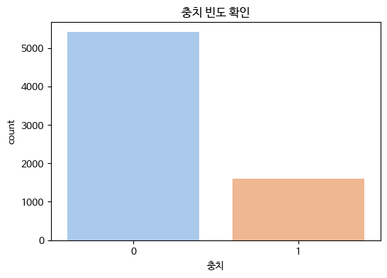
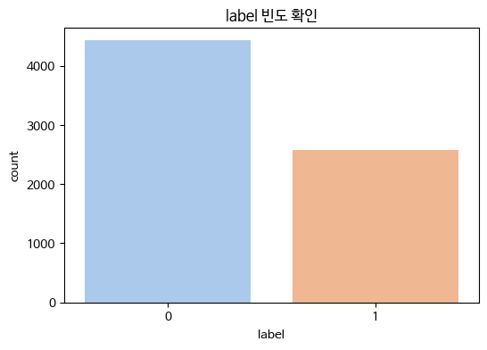
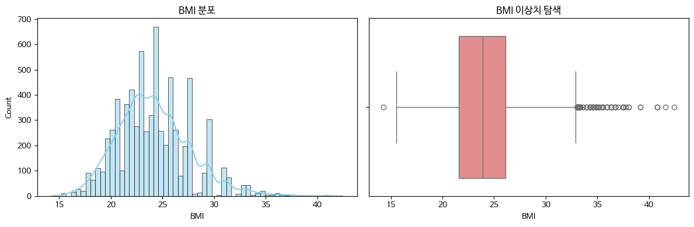
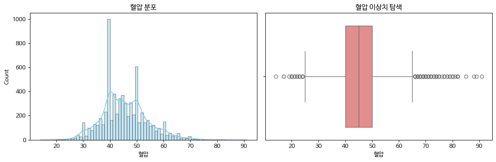
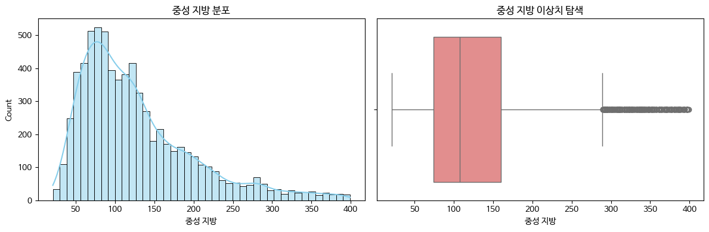
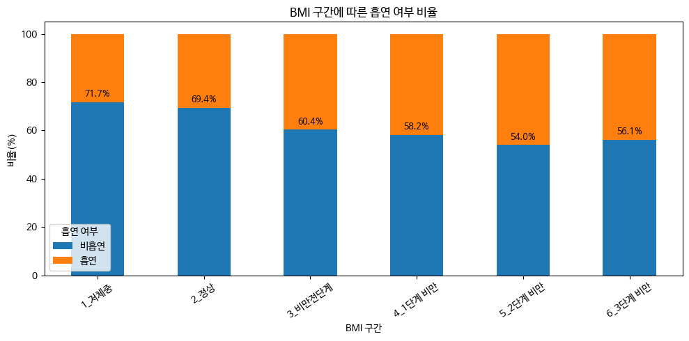
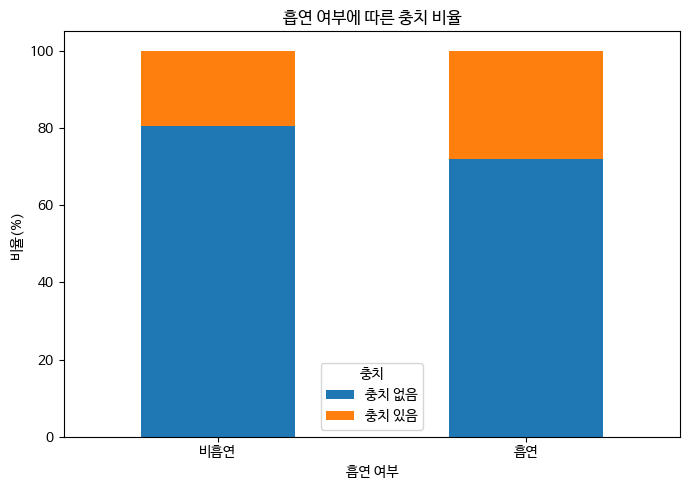
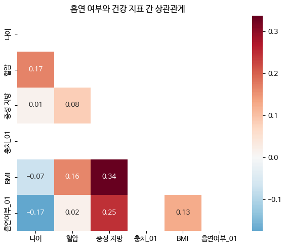

# 오즈 동아리 흡연 여부 데이터 분석
팀원 : 진형님, 한솔님, 희진님, 상균님
> GitHub 업로드용으로 변환한 Markdown 문서입니다. 코드 셀은 Python 코드 블록으로 정리했고, 주요 출력과 그래프 이미지는 `assets/` 폴더에 분리했습니다.

## 목차

- [AI 헬스케어 첫 번째 미니 프로젝트](#ai-헬스케어-첫-번째-미니-프로젝트)
  - [🚬 흡연 여부 데이터 분석하기](#🚬-흡연-여부-데이터-분석하기)
- [0. 필요한 라이브러리 및 데이터 불러오기](#0-필요한-라이브러리-및-데이터-불러오기)
- [1. 데이터 기본 정보 확인 및 전처리](#1-데이터-기본-정보-확인-및-전처리)
- [2. 가설 수립](#2-가설-수립)
- [3. 단변량 분석](#3-단변량-분석)
- [4. 이변량 분석](#4-이변량-분석)
- [5. 변수 간 상관관계 분석 (Correlation Analysis)](#5-변수-간-상관관계-분석-correlation-analysis)
- [6. 결론 및 인사이트 도출](#6-결론-및-인사이트-도출)

---

## AI 헬스케어 첫 번째 미니 프로젝트
흡연 여부 데이터 분석을 통한 건강 인사이트 도출에 오신 여러분 환영합니다!  
우리는 흡연 관련 건강 데이터를 분석하여 시각화하고, 다양한 가설을 검증해보는 과정을 함께 할 것입니다.   
A부터 Z까지 친절하게 안내해 드릴 예정이니, 천천히 따라해 보세요!

### 🚬 흡연 여부 데이터 분석하기
최근 여러 기관에서는 흡연이 개인의 건강에 미치는 영향을 정확히 파악하고,
이를 기반으로 예방 중심의 건강관리 정책을 수립하려는 노력을 강화하고 있습니다.

하지만 “흡연 여부”를 직접 조사하는 것은 현실적으로 쉽지 않습니다.
이에 따라, 건강검진 데이터를 통해 흡연 여부를 데이터 기반으로 추정하고,
흡연자와 비흡연자 간의 생체·건강 지표 차이를 검증하려는 프로젝트가 시작되었습니다.

여러분은 이 프로젝트의 데이터 분석가이자 AI 엔지니어로 참여하게 되었습니다.
주어진 데이터에는 개인의 건강검진 결과(혈압, 혈당, 콜레스테롤, BMI 등)와 흡연 여부(label = 0 또는 1)가 포함되어 있습니다.

이제 여러분의 역할은 흡연 여부 데이터의 특성을 분석하고 시각화하며, 통계적 검정을 통해 변수 간 관계를 규명하는 것입니다.
시작해봅시다 !

#### 🎯 프로젝트 목표

- 흡연자와 비흡연자 간의 건강 지표 차이 분석
- 주요 변수들의 분포, 상관관계, 통계적 유의성 검증
- 시각화를 통한 데이터 인사이트 도출
- 추후 흡연 여부 예측 모델 개발을 위한 기초 분석 기반 마련


---

## 0. 필요한 라이브러리 및 데이터 불러오기
본격적인 데이터 분석을 시작하기 전에, 필요한 라이브러리들을 불러오고 분석에 사용할 데이터를 로드합니다.

##### **[TODO] 라이브러리 설치 및 데이터 로딩**

- 분석에 필요한 라이브러리를 별칭을 사용해 불러오세요.
- `smoking_health_data.csv` 파일을 `health_data` 라는 변수에 저장하세요.
- 로드된 `health_data` DataFrame의 크기를 확인하여 데이터가 올바르게 불러와졌는지 검증하세요.

<!-- code cell 3 -->
```python
# 필요한 라이브러리들 불러오기
import pandas as pd
import matplotlib as plt
import seaborn as sns
```

<!-- code cell 4 -->
```python
# 아래에 실습코드를 작성하고 결과를 확인합니다.
health_data=pd.read_csv('smoking_health_data.csv')
```

<!-- code cell 5 -->
```python
# 아래에 실습코드를 작성하고 결과를 확인합니다.
health_data.shape
```

<details>
<summary>출력 보기</summary>

```text
(7000, 18)
```

</details>

<!-- code cell 6 -->
```python
!sudo apt-get install -y fonts-nanum
!sudo fc-cache -fv
!rm ~/.cache/matplotlib -rf

print("폰트 설치가 완료되었습니다. 반드시 '런타임 > 세션 다시 시작'을 누르고 아래 코드를 실행하세요!")
```

<details>
<summary>출력 보기</summary>

```text
폰트 설치가 완료되었습니다. 반드시 '런타임 > 세션 다시 시작'을 누르고 아래 코드를 실행하세요!
```

</details>

<!-- code cell 7 -->
```python
# 시각화 라이브러리
import matplotlib.pyplot as plt
import seaborn as sns

# 한글 폰트 설정 (그래프에서 한글 깨짐 방지)
plt.rc('font', family='NanumBarunGothic')
plt.rcParams['axes.unicode_minus'] = False # 마이너스 기호 깨짐 방지

print("라이브러리 로딩 완료!")
```

<details>
<summary>출력 보기</summary>

```text
라이브러리 로딩 완료!
```

</details>

---
## 1. 데이터 기본 정보 확인 및 전처리

데이터의 구조를 파악하고, 필요한 전처리 작업을 수행합니다.

##### **[TODO] 데이터 기본 정보 확인**

`health_data` DataFrame의 기본 정보를 확인하여 데이터의 전체적인 구조를 이해합니다.

<!-- code cell 9 -->
```python
# 아래에 실습코드를 작성하고 결과를 확인합니다.
health_data.info()
```

<details>
<summary>출력 보기</summary>

```text
<class 'pandas.core.frame.DataFrame'>
RangeIndex: 7000 entries, 0 to 6999
Data columns (total 18 columns):
 #   Column    Non-Null Count  Dtype  
---  ------    --------------  -----  
 0   ID        7000 non-null   object 
 1   나이        7000 non-null   int64  
 2   키(cm)     7000 non-null   int64  
 3   몸무게(kg)   7000 non-null   int64  
 4   BMI       7000 non-null   float64
 5   시력        6860 non-null   float64
 6   충치        7000 non-null   int64  
 7   공복 혈당     6860 non-null   float64
 8   혈압        6860 non-null   float64
 9   중성 지방     6860 non-null   float64
 10  혈청 크레아티닌  7000 non-null   float64
 11  콜레스테롤     7000 non-null   int64  
 12  고밀도지단백    7000 non-null   int64  
 13  저밀도지단백    7000 non-null   int64  
 14  헤모글로빈     7000 non-null   float64
 15  요 단백      7000 non-null   int64  
 16  간 효소율     7000 non-null   float64
 17  label     7000 non-null   int64  
dtypes: float64(8), int64(9), object(1)
memory usage: 984.5+ KB
```

</details>

<!-- code cell 10 -->
```python
# 아래에 실습코드를 작성하고 결과를 확인합니다.
# #describe(): 숫자형 컬럼의 통계 요약 (평균, 표준편차, 최솟값, 최댓값 등)을 확인합니다.
# head(): 데이터의 상위 5행을 확인하여 샘플 데이터를 살펴봅니다.
# tail()
health_data.describe()
```

<details>
<summary>출력 보기</summary>

```text
                나이        키(cm)      몸무게(kg)          BMI           시력  \
count  7000.000000  7000.000000  7000.000000  7000.000000  6860.000000   
mean     43.973571   164.781429    65.932857    24.144423     1.011414   
std      12.063793     9.170213    12.978702     3.501945     0.430137   
min      20.000000   135.000000    30.000000    14.270000     0.100000   
25%      35.000000   160.000000    55.000000    21.600000     0.800000   
50%      40.000000   165.000000    65.000000    23.880000     1.000000   
75%      50.000000   170.000000    75.000000    26.120000     1.200000   
max      85.000000   190.000000   130.000000    42.450000     9.900000   

                충치        공복 혈당           혈압        중성 지방     혈청 크레아티닌  \
count  7000.000000  6860.000000  6860.000000  6860.000000  7000.000000   
mean      0.227429    99.307289    45.555102   127.028134     0.884900   
std       0.419202    21.190058     8.831564    73.219161     0.241523   
min       0.000000    57.000000    14.000000    21.000000     0.100000   
25%       0.000000    89.000000    40.000000    74.000000     0.800000   
50%       0.000000    96.000000    45.000000   107.000000     0.900000   
75%       0.000000   104.000000    50.000000   161.000000     1.000000   
max       1.000000   386.000000    91.000000   399.000000    10.000000   

             콜레스테롤       고밀도지단백       저밀도지단백        헤모글로빈         요 단백  \
count  7000.000000  7000.000000  7000.000000  7000.000000  7000.000000   
mean    197.276571    57.355429   115.346857    14.631914     1.083857   
std      36.306494    14.506945    41.788153     1.540907     0.392051   
min      86.000000    18.000000     1.000000     4.900000     1.000000   
25%     173.000000    47.000000    92.000000    13.600000     1.000000   
50%     195.000000    55.000000   113.000000    14.800000     1.000000   
75%     219.000000    66.000000   136.000000    15.700000     1.000000   
max     395.000000   157.000000  1340.000000    20.900000     5.000000   

             간 효소율        label  
count  7000.000000  7000.000000  
mean      1.144696     0.367286  
std       0.432735     0.482100  
min       0.140000     0.000000  
25%       0.840000     0.000000  
50%       1.100000     0.000000  
75%       1.380000     1.000000  
max       5.670000     1.000000  
```

</details>

<!-- code cell 11 -->
```python
# 아래에 실습코드를 작성하고 결과를 확인합니다.
health_data.head()
```

<details>
<summary>출력 보기</summary>

```text
           ID  나이  키(cm)  몸무게(kg)    BMI    시력  충치  공복 혈당    혈압  중성 지방  \
0  TRAIN_0000  35    170       70  24.22  1.10   1   98.0  40.0   80.0   
1  TRAIN_0001  40    150       55  24.44  1.00   0  173.0  39.0  104.0   
2  TRAIN_0002  60    170       50  17.30  0.75   0   96.0  40.0   61.0   
3  TRAIN_0003  40    150       45  20.00  0.50   0   92.0  40.0   46.0   
4  TRAIN_0004  55    155       65  27.06   NaN   0   87.0  42.0   95.0   

   혈청 크레아티닌  콜레스테롤  고밀도지단백  저밀도지단백  헤모글로빈  요 단백  간 효소율  label  
0       1.3    211      75     120   15.9     1   1.53      1  
1       0.6    251      46     184   11.8     1   1.45      0  
2       0.8    144      43      89   15.3     1   1.04      0  
3       0.7    178      66     110   13.4     1   1.18      0  
4       0.9    232      62     151   13.8     1   1.32      0  
```

</details>

<!-- code cell 12 -->
```python
# 아래에 실습코드를 작성하고 결과를 확인합니다.
health_data.tail()
```

<details>
<summary>출력 보기</summary>

```text
              ID  나이  키(cm)  몸무게(kg)    BMI    시력  충치  공복 혈당    혈압  중성 지방  \
6995  TRAIN_6995  25    170       65  22.49  1.50   0   87.0  45.0  141.0   
6996  TRAIN_6996  60    165       65  23.88  0.90   0   87.0  45.0   82.0   
6997  TRAIN_6997  40    180      100  30.86  1.20   0   97.0  44.0   87.0   
6998  TRAIN_6998  60    150       55  24.44  0.60   0   89.0  57.0  161.0   
6999  TRAIN_6999  50    165       65  23.88  0.65   0  104.0  47.0  124.0   

      혈청 크레아티닌  콜레스테롤  고밀도지단백  저밀도지단백  헤모글로빈  요 단백  간 효소율  label  
6995       1.2    184      44     112   14.9     1   1.50      0  
6996       0.9    184      64     103   14.3     1   1.47      1  
6997       0.9    178      54     107   15.6     1   1.00      0  
6998       0.6    157      49      76   14.4     1   1.00      0  
6999       0.8    251      56     170   13.6     1   0.81      0  
```

</details>

<!-- code cell 13 -->
```python
def bmi_interval(bmi):
    if bmi < 18.5:
        return '1_저체중'
    elif bmi <= 22.9:
        return '2_정상'
    elif bmi <= 24.9:
        return '3_비만전단계'
    elif bmi <= 29.9:
        return '4_1단계 비만'
    elif bmi <= 34.9:
        return '5_2단계 비만'
    else:
        return '6_3단계 비만'

bmi_order = [
    '1_저체중',
    '2_정상',
    '3_비만전단계',
    '4_1단계 비만',
    '5_2단계 비만',
    '6_3단계 비만'
]

health_data['BMI 구간'] = health_data['BMI'].apply(bmi_interval)
health_data['BMI 구간'] = pd.Categorical(health_data['BMI 구간'], categories=bmi_order, ordered=True)

health_data[['BMI', 'BMI 구간']].head()
```

<details>
<summary>출력 보기</summary>

```text
     BMI    BMI 구간
0  24.22   3_비만전단계
1  24.44   3_비만전단계
2  17.30     1_저체중
3  20.00      2_정상
4  27.06  4_1단계 비만
```

</details>

<!-- code cell 14 -->
```python
def age_group(age):
    if age < 30:
        return '20대'
    elif age < 40:
        return '30대'
    elif age < 50:
        return '40대'
    elif age < 60:
        return '50대'
    elif age < 70:
        return '60대'
    elif age <= 70:
        return '70대'
    else:
        return '70대 초과'

health_data['나이대'] = health_data['나이'].apply(age_group)

health_data[['나이', '나이대']].head(10)
```

<details>
<summary>출력 보기</summary>

```text
   나이  나이대
0  35  30대
1  40  40대
2  60  60대
3  40  40대
4  55  50대
5  50  50대
6  60  60대
7  40  40대
8  40  40대
9  45  40대
```

</details>

##### **[TODO] 결측치 확인**

`health_data` DataFrame에 결측값(누락된 값)이 있는지 확인합니다.

<!-- code cell 16 -->
```python
# 아래에 실습코드를 작성하고 결과를 확인합니다.
print('결측치 처리 전')
print(health_data.isnull().sum())
```

<details>
<summary>출력 보기</summary>

```text
결측치 처리 전
ID            0
나이            0
키(cm)         0
몸무게(kg)       0
BMI           0
시력          140
충치            0
공복 혈당       140
혈압          140
중성 지방       140
혈청 크레아티닌      0
콜레스테롤         0
고밀도지단백        0
저밀도지단백        0
헤모글로빈         0
요 단백          0
간 효소율         0
label         0
BMI 구간        0
나이대           0
dtype: int64
```

</details>

##### **[TODO] 결측치 처리 전략 수립 및 적용**

결측값이 발견되었다면, 해당 변수의 특성과 의미를 고려하여 가장 적절한 방법으로 결측치를 처리해 보세요.

-   **삭제**: 결측값이 적거나, 해당 데이터가 분석에 필수적이지 않을 경우 행 또는 열을 삭제합니다.
-   **대체**: 평균, 중앙값, 최빈값, 또는 특정 값으로 대체합니다.

<!-- code cell 18 -->
```python
# 아래에 실습코드를 작성하고 결과를 확인합니다.
# 혈압은 중앙값으로 채우기
health_data['혈압'] = health_data['혈압'].fillna(health_data['혈압'].median())
```

<!-- code cell 19 -->
```python
# 아래에 실습코드를 작성하고 결과를 확인합니다.
# 시력은 최빈값으로 채우기
health_data['시력'] = health_data['시력'].fillna(health_data['시력'].mode()[0])
```

<!-- code cell 20 -->
```python
# 아래에 실습코드를 작성하고 결과를 확인합니다.
# 중성 지방은 나이대별 평균으로 채우기
health_data['중성 지방'] = health_data.groupby('나이대')['중성 지방'].transform(lambda x: x.fillna(x.mean()))
```

<!-- code cell 21 -->
```python
# 아래에 실습코드를 작성하고 결과를 확인합니다.
# 나이대별 평균으로도 채워지지 않은 값이 있으면 전체 평균으로 한 번 더 채우기
health_data['중성 지방'] = health_data['중성 지방'].fillna(health_data['중성 지방'].mean())
```

<!-- code cell 22 -->
```python
# 공복 혈당은 평균으로 채우기
health_data['공복 혈당'] = health_data['공복 혈당'].fillna(health_data['공복 혈당'].mean())
```

<!-- code cell 23 -->
```python
print()
print('결측치 처리 후')
print(health_data.isnull().sum())
```

<details>
<summary>출력 보기</summary>

```text

결측치 처리 후
ID          0
나이          0
키(cm)       0
몸무게(kg)     0
BMI         0
시력          0
충치          0
공복 혈당       0
혈압          0
중성 지방       0
혈청 크레아티닌    0
콜레스테롤       0
고밀도지단백      0
저밀도지단백      0
헤모글로빈       0
요 단백        0
간 효소율       0
label       0
BMI 구간      0
나이대         0
dtype: int64
```

</details>

---
## 2. 가설 수립

흡연 여부(label)에 따라 각 건강 지표에 통계적으로 유의미한 차이가 있는지 검증하기 위한 가설을 수립합니다.

각 건강 지표(예: BMI, 혈압, 혈당 등)에 대해 최소 3개 이상의 가설을 작성해 보세요.

**(예시)**
-   **H₀ (귀무가설)**: 흡연자와 비흡연자의 평균 BMI는 같다.
-   **H₁ (대립가설)**: 흡연자와 비흡연자의 평균 BMI는 다르다.

##### **[TODO] 가설 작성**

다음 코드 셀에 여러분의 가설들을 작성해 주세요.

가설 1.BMI

귀무가설 (H₀)- BMI 따른 흡연자 비율에는 차이가 없다.

대립가설 (H₁)- BMI가 증가할수록 흡연자 비율이 증가한다.

가설 2.충치

귀무가설 (H₀)- 흡연 여부에 따른 충치 발생 비율에는 차이가 없다.

대립가설 (H₁)- 흡연자는 비흡연자에 비해 충치 발생 비율이 더 높다.

가설 3.중성 지방

귀무가설 (H₀)- 흡연 여부에 따른 중성지방 평균에는 차이가 없다.

대립가설 (H₁)- 흡연자는 비흡연자에 비해 중성지방 평균이 더 높다.

가설 4.혈압

귀무가설 (H₀)- 흡연 여부에 따른 혈압 평균에는 차이가 없다.

대립가설 (H₁)- 흡연자는 비흡연자에 비해 혈압 평균이 더 높다.

---
## 3. 단변량 분석

단변량 분석은 각 변수(컬럼)의 특성을 개별적으로 탐색하는 과정입니다. 이를 통해 데이터의 전반적인 이해도를 높이고, 이상치나 결측값 등의 문제점을 파악할 수 있습니다.

#### 단변량 분석의 목적

-   **데이터 품질 확인**: 결측값, 이상치 등의 존재 여부를 파악합니다.
-   **변수 유형 이해**: 각 변수가 숫자형인지 범주형인지 구분하고, 데이터의 특성을 파악합니다.
-   **기초 통계량 확인**: 평균, 중앙값, 표준편차 등 핵심 통계치를 통해 데이터의 중심 경향과 퍼짐 정도를 파악합니다.
-   **분포 시각화**: 히스토그램, 박스 플롯 등을 통해 변수의 분포 형태를 시각적으로 확인합니다.
-   **전처리 필요성 판단**: NaN 값 처리, 가변수(Dummy Variable) 생성 등 추가 전처리 필요성을 결정합니다.
-   **비즈니스 인사이트 도출**: 각 변수가 어떤 의미를 가지며, 어떤 비즈니스적 함의를 갖는지 정리합니다.
-   **추가 분석 아이디어 발굴**: 단변량 분석 결과로부터 더 깊이 탐색할 만한 주제나 관계를 도출합니다.

##### **[TODO] 단변량 분석 수행**

다음 코드 셀에서 `health_data` DataFrame의 각 변수에 대해 단변량 분석을 수행해 보세요.

<!-- code cell 27 -->
```python
# 아래에 실습코드를 작성하고 결과를 확인합니다.
#충치 여부 & 흡연 여부 (범주형 변수)
cat_cols = ['충치', 'label'] # 실제 컬럼명 확인 필요

for col in cat_cols:
    plt.figure(figsize=(6, 4))

    # 빈도수 시각화
    sns.countplot(x=col, data=health_data, palette='pastel')
    plt.title(f'{col} 빈도 확인')

    # 비율 계산
    counts = health_data[col].value_counts()
    percentage = health_data[col].value_counts(normalize=True) * 100

    plt.show()

    print(f"--- {col} 비율 ---")
    for idx, val in percentage.items():
        print(f"[{idx}]: {val:.2f}% ({counts[idx]}명)")
    print("\n")
```

<details>
<summary>출력 보기</summary>



```text
--- 충치 비율 ---
[0]: 77.26% (5408명)
[1]: 22.74% (1592명)
```



```text
--- label 비율 ---
[0]: 63.27% (4429명)
[1]: 36.73% (2571명)
```

</details>

<!-- code cell 28 -->
```python
# 아래에 실습코드를 작성하고 결과를 확인합니다.
#BMI & 혈압 & 중성지방 (수치형 변수)
num_cols = ['BMI', '혈압', '중성 지방'] # 실제 컬럼명 확인 필요

for col in num_cols:
    plt.figure(figsize=(12, 4))

    # 히스토그램 (분포 확인)
    plt.subplot(1, 2, 1)
    sns.histplot(health_data[col], kde=True, color='skyblue')
    plt.title(f'{col} 분포')

    # 박스플롯 (이상치 확인)
    plt.subplot(1, 2, 2)
    sns.boxplot(x=health_data[col], color='lightcoral')
    plt.title(f'{col} 이상치 탐색')

    plt.tight_layout()
    plt.show()

    # 기초 통계량 출력
    print(f"--- {col} 통계 요약 ---")
    print(health_data[col].describe())
    print("\n")
```

<details>
<summary>출력 보기</summary>



```text
--- BMI 통계 요약 ---
count    7000.000000
mean       24.144423
std         3.501945
min        14.270000
25%        21.600000
50%        23.880000
75%        26.120000
max        42.450000
Name: BMI, dtype: float64
```



```text
--- 혈압 통계 요약 ---
count    7000.000000
mean       45.544000
std         8.743135
min        14.000000
25%        40.000000
50%        45.000000
75%        50.000000
max        91.000000
Name: 혈압, dtype: float64
```



```text
--- 중성 지방 통계 요약 ---
count    7000.000000
mean      127.022244
std        72.492952
min        21.000000
25%        74.000000
50%       108.000000
75%       160.000000
max       399.000000
Name: 중성 지방, dtype: float64
```

</details>

#범주형 변수:

label (흡연 여부): 데이터셋은 비흡연자(label=0)가 약 63%로 흡연자(label=1)보다 더 많은 불균형한 분포를 보였습니다.

BMI 구간: '정상' 및 '1단계 비만' 그룹에 가장 많은 인원이 분포하며, '저체중'과 '3단계 비만' 그룹은 상대적으로 적었습니다. 이는 대부분의 참여자가 평균적인 체중 범주에 속함을 나타냅니다.

나이 대: 40대와 50대 그룹이 가장 많은 비중을 차지하며, 20대와 70대 초과 그룹은 적은 편입니다. 이는 데이터가 중장년층에 집중되어 있음을 시사합니다.

충치: '충치 없음'이 '충치 있음'보다 훨씬 많은 비중을 차지하여, 충치가 없는 경우가 대부분임을 알 수 있습니다.

#숫자형 변수:

대부분의 숫자형 변수(예: '나이', '키(cm)', '몸무게(kg)', 'BMI', '공복 혈당', '콜레스테롤', '헤모글로빈')는 대체로 정규 분포와 유사한 형태를 보이거나 약간 오른쪽으로 치우친 분포를 보였습니다.

일부 변수(예: '중성 지방', '혈청 크레아티닌', '간 효소율')에서는 극단적인 이상치(outliers)가 박스플롯을 통해 확인되었습니다. 이러한 이상치는 데이터 입력 오류일 수도 있고, 실제로 건강 상태가 매우 특이한 경우일 수도 있습니다.

'시력'과 '혈압' 등은 특정 값에 집중되는 경향을 보였는데, 이는 측정 방식이나 데이터 수집의 특성 때문일 수 있습니다. '요 단백'은 대부분의 값이 1에 집중되어 있어, 변별력이 높지 않을 수 있음을 시사합니다.

---
## 4. 이변량 분석

이변량 분석은 두 변수 간의 관계를 탐색하는 과정입니다. 이를 통해 변수들이 서로 어떻게 영향을 주고받는지 파악하고, 주요 예측 변수를 선별할 수 있습니다.

#### 이변량 분석의 목적

-   **변수 간 관계 탐색**: 원인-결과 관계 또는 상호 연관성을 파악합니다.
-   **주요 영향 요인 도출**: 어떤 변수가 목표 변수(예: 흡연 여부)에 가장 큰 영향을 미 미치는지 확인합니다.
-   **예측 모델 Feature 선별**: 향후 예측 모델 구축 시 중요한 특성(Feature) 후보를 선별합니다.

#### 가설 검정 가이드라인

수립한 가설들을 검정하기 위해 변수 유형에 따라 다음 통계 검정 방법을 활용합니다.

  - 유의수준 : 일반적으로 5% (0.05)를 기준으로 합니다.
  - 숫자형 변수 vs 숫자형 변수 : 상관분석 (Correlation Analysis)
  - 범주형 변수 vs 범주형 변수 : 카이제곱 검정 (Chi-squared Test)
  - 범주형 변수 vs 숫자형 변수 : t-검정 (t-test), 분산 분석 (ANOVA)
  - 숫자형 변수 vs 범주형 변수 : 로지스틱 회귀모형을 통해, 회귀계수의 P-value로 검정을 수행합니다.

##### **[TODO] 이변량 분석 수행**

다음 코드 셀에서 수립한 가설들을 바탕으로 이변량 분석을 수행하고, 결과를 해석해 보세요.

<!-- code cell 31 -->
```python
health_data = health_data.rename(columns={'label': '흡연 여부'})

health_data['흡연 여부'] = health_data['흡연 여부'].map({1: '흡연', 0: '비흡연'})
```

<!-- code cell 32 -->
```python
# 아래에 실습코드를 작성하고 결과를 확인합니다.
# 이변량 분석 1: 수립한 가설에 맞춰 그룹별 비율과 평균을 비교합니다.

# 1) BMI 구간별 흡연 여부 비율
bmi_smoking_count = pd.crosstab(health_data['BMI 구간'], health_data['흡연 여부']).reindex(bmi_order)
bmi_smoking_ratio = pd.crosstab(
    health_data['BMI 구간'],
    health_data['흡연 여부'],
    normalize='index'
).reindex(bmi_order) * 100

bmi_result_table = pd.DataFrame({
    '전체 인원': bmi_smoking_count.sum(axis=1),
    '비흡연자 비율(%)': bmi_smoking_ratio['비흡연'].round(1),
    '흡연자 비율(%)': bmi_smoking_ratio['흡연'].round(1)
})

print('BMI 구간별 흡연 여부 비율')
display(bmi_result_table)

ax = bmi_smoking_ratio[['비흡연', '흡연']].plot(
    kind='bar',
    stacked=True,
    figsize=(10, 5),
    rot=35
)
plt.title('BMI 구간에 따른 흡연 여부 비율')
plt.xlabel('BMI 구간')
plt.ylabel('비율(%)')
plt.legend(title='흡연 여부', loc='lower left')
for x, value in enumerate(bmi_result_table['비흡연자 비율(%)']):
    ax.text(x, value + 1, f'{value:.1f}%', ha='center', va='bottom', fontsize=9)
plt.tight_layout()
plt.show()

# 2) 흡연 여부에 따른 충치 발생 비율
health_data['충치 여부'] = health_data['충치'].map({0: '충치 없음', 1: '충치 있음'})

tooth_count = pd.crosstab(health_data['흡연 여부'], health_data['충치 여부']).reindex(['비흡연', '흡연'])
tooth_ratio = pd.crosstab(
    health_data['흡연 여부'],
    health_data['충치 여부'],
    normalize='index'
).reindex(['비흡연', '흡연']) * 100

print('흡연 여부별 충치 발생 비율')
display(tooth_ratio.round(1))

ax = tooth_ratio[['충치 없음', '충치 있음']].plot(
    kind='bar',
    stacked=True,
    figsize=(7, 5),
    rot=0
)
plt.title('흡연 여부에 따른 충치 비율')
plt.xlabel('흡연 여부')
plt.ylabel('비율(%)')
plt.legend(title='충치', loc='lower center')
plt.tight_layout()
plt.show()

# 3) 흡연 여부별 숫자형 건강 지표 평균/중앙값
compare_cols = ['BMI', '중성 지방', '혈압']
group_mean = health_data.groupby('흡연 여부')[compare_cols].mean().reindex(['비흡연', '흡연']).round(2)
group_median = health_data.groupby('흡연 여부')[compare_cols].median().reindex(['비흡연', '흡연']).round(2)

print('흡연 여부별 평균')
display(group_mean)

print('흡연 여부별 중앙값')
display(group_median)
```

<details>
<summary>출력 보기</summary>

```text
BMI 구간별 흡연 여부 비율
```

```text
          전체 인원  비흡연자 비율(%)  흡연자 비율(%)
BMI 구간                                
1_저체중       230        71.7       28.3
2_정상       2728        69.4       30.6
3_비만전단계    1418        60.4       39.6
4_1단계 비만   2261        58.2       41.8
5_2단계 비만    322        54.0       46.0
6_3단계 비만     41        56.1       43.9
```



```text
흡연 여부별 충치 발생 비율
```

```text
충치 여부  충치 없음  충치 있음
흡연 여부              
비흡연     80.4   19.6
흡연      71.8   28.2
```



```text
흡연 여부별 평균
```

```text
         BMI   중성 지방     혈압
흡연 여부                      
비흡연    23.81  113.45  45.42
흡연     24.73  150.40  45.76
```

```text
흡연 여부별 중앙값
```

```text
         BMI  중성 지방    혈압
흡연 여부                    
비흡연    23.44   97.0  45.0
흡연     24.22  131.0  45.0
```

</details>

# 이변량 분석에서 파악한 내용을 정리해보세요.

흡연자의 중성지방이 비흡연자보다 높은 편이다.
BMI 구간에서 BMI가 높아질 수록 흡연자의 비율이 늘어나는 양상을 보인다.

---
## 5. 변수 간 상관관계 분석 (Correlation Analysis)

##### **[TODO] 상관관계 분석 및 Heatmap 시각화**

- **상관계수 계산**: `health_data` DataFrame 내의 숫자형 변수들 간의 상관계수 행렬을 계산합니다.
- **Heatmap 시각화**: 계산된 상관계수 행렬을 Heatmap을 사용하여 시각화합니다.

#### 상관계수 해석 기준

-   **1에 가까울수록 (강한 양의 상관관계)**: 한 변수가 증가할 때 다른 변수도 함께 증가하는 경향이 매우 강합니다.
-   **-1에 가까울수록 (강한 음의 상관관계)**: 한 변수가 증가할 때 다른 변수는 감소하는 경향이 매우 강합니다.
-   **0에 가까울수록 (약한 상관관계)**: 두 변수 사이에 선형적인 관계가 거의 없거나 매우 약합니다.

<!-- code cell 35 -->
```python
# 아래에 실습코드를 작성하고 상관계수를 확인 및 시각화 합니다.
import numpy as np
health_data['흡연여부_01'] = health_data['흡연 여부'].map({'흡연': 1, '비흡연': 0})
health_data['충치_01'] = health_data['충치'].map({'충치 있음': 1, '충치 없음': 0})

cols = ['나이', '혈압', '중성 지방', '충치_01', 'BMI', '흡연여부_01']
corr = health_data[cols].corr()
mask = np.triu(np.ones_like(corr, dtype=bool))

plt.figure(figsize=(6,5))
sns.heatmap(corr, mask=mask, annot=True, fmt=".2f", center=0, cmap='RdBu_r')

plt.title('흡연 여부와 건강 지표 간 상관관계')
plt.tight_layout()
plt.show()
```

<details>
<summary>출력 보기</summary>



</details>

<!-- code cell 36 -->
```python
# 강한 관계를 보이는 변수에는 어떤 것이 있나요 ?

#'BMI'와 '중성 지방' (0.34), '중성 지방'과 'label' (0.25) 등이 있다.
```

<!-- code cell 37 -->
```python
# 약한 관계를 보이는 변수에는 어떤 것이 있나요 ?

#'혈압'과 '충치' (0.01), '혈압'과 'label' (0.02) 등이 있다.
```

---
## 6. 결론 및 인사이트 도출

##### **[TODO] 주요 인사이트 제시**

어떤 건강 요인(변수)들이 흡연 여부와 가장 높은 관련성을 보이는지, 그리고 그 이유는 무엇인지 구체적인 데이터를 바탕으로 설명해 주세요.

**(예시)**
-   흡연자는 비흡연자에 비해 평균 혈압과 중성지방 수치가 통계적으로 유의미하게 높았습니다 (p < 0.05).
-   반면, BMI는 흡연 여부에 따른 유의미한 차이를 보이지 않았습니다 (p > 0.05).
-   따라서 흡연은 특히 대사 관련 지표(혈압, 중성지방)에 더 큰 영향을 미치는 것으로 해석할 수 있습니다. 이는 심혈관 질환 발생 위험 증가와 연관될 수 있습니다.
-   이러한 분석 결과를 바탕으로, 흡연 관련 건강 관리 정책 수립 시 혈압 및 중성지방 수치 관리에 대한 강조가 필요합니다.

다음 코드 셀에 여러분의 분석 결과를 바탕으로 도출된 결론과 인사이트를 작성해 주세요.

# 어떤 요인이 흡연 여부와 관련성이 높을까요 ? 그 이유는?
흡연은 중성지방 및 충치와 같은 건강 지표와 연관성을 보이며, 전반적으로 건강에 부정적인 영향을 미칠 가능성이 확인됨.

#한계점

관찰 데이터 기반 → 전후 인과관계 판단 불가,

데이터 수집에 대한 한계 - 혈압 데이터가 실제 데이터가 아닌 점

성별에 관한 데이터 없음, 흡연자/비흡연자 수, 나이대가 비슷하게 수집되지 않았던 점, 생활 습관이 포함되지 않은 점
